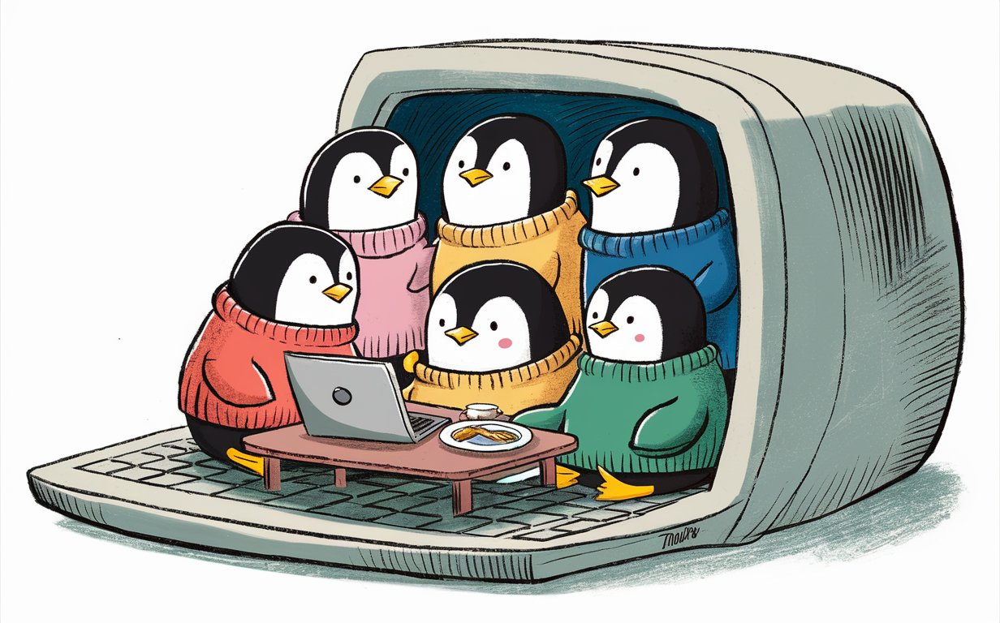

# The Ubuntu Family (SVG)

The Ubuntu logos contained in this image **(UbuntuFamily.svg)** are copyright of their respective flavors.
- Ubuntu - https://ubuntu.com/
- Edubuntu - https://www.edubuntu.org/
- Kubuntu - https://kubuntu.org/
- Lubuntu - https://lubuntu.me/
- Ubuntu Budgie - https://ubuntubudgie.org/
- Ubuntu Cinnamon - https://ubuntucinnamon.org/
- Ubuntu Kylin - https://www.ubuntukylin.com
- Ubuntu MATE - https://ubuntu-mate.org/
- Ubuntu Studio - https://ubuntustudio.org/
- Ubuntu Unity - https://ubuntuunity.org/
- Xubuntu - https://xubuntu.org/

# penguins-in-a-pc.jpeg
While the preceeding image contains elements belonging to their respective copyright holders that should be respected, the following image **(penguins-in-a-pc.jpeg)** was created using DALL-E 2. I asked for a bunch of penguins in a monitor done in a cartoon style. This is what I got. While it was a spectacular failure of what I was looking for, it was an amazing success in its own right. As is AI Generated art, I claim no copyright on it.
Enjoy as you see fit!

